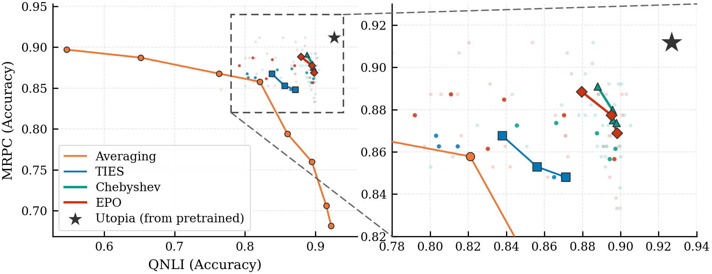
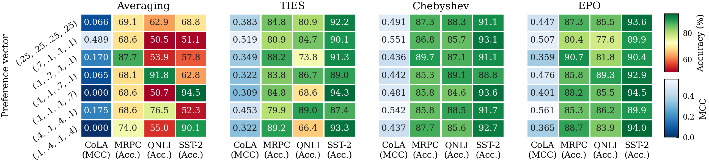

[](https://github.com/robin-koppelhuber/Bachelor-Thesis-SML/blob/master/pyproject.toml) [](https://github.com/astral-sh/uv) [](https://pytorch.org/)

# Quantifying the Approximation Error of Task-Vector Merging in the Convex Hull

Source code for my bachelor thesis at the [ETH Statistical Machine Learning Lab](https://sml.inf.ethz.ch/)

> **[Read the thesis [PDF]](ETHZ_BSC_Thesis_SML.pdf)**

## About

A dominant class of model merging methods combines fine-tuned expert models by searching over convex combinations of their task vectors — a subset of parameter space with dimension at most the number of tasks minus one. While prior work has shown that useful trade-offs exist within this convex set, the approximation error incurred by restricting the search to such a low-dimensional subspace has not been quantified.

This benchmark compares two data-free merging methods constrained to the convex hull (Task Arithmetic, TIES-Merging) against two training-based multi-objective optimization methods that optimize over the full parameter space (augmented Chebyshev scalarization, EPO Search). All methods are evaluated on binary GLUE tasks using RoBERTa-base across both a four-task and a focused two-task setting.

**Key findings:**
- Training-based methods consistently achieve trade-offs in objective space that are unattainable within the convex hull of task vectors
- Task-vector averaging degrades catastrophically under destructive interference; TIES-Merging substantially mitigates this but retains a persistent gap to gradient-based methods.
- On the two-task benchmark (MRPC–QNLI), the TIES Pareto front is clearly dominated despite a dense search over merging coefficients — indicating the gap is a geometric property of the convex set itself rather than a failure to find optimal coefficients.

These results suggest that in overparameterized multi-task settings, the convex hull of task vectors is a fundamentally limited model class.



*Each point is a different trade-off configuration — how much weight to place on each task. The star marks the best performance achievable on each task independently. Training-based methods (Chebyshev, EPO) reach trade-offs that merging cannot, even after an exhaustive search over merging coefficients.*



*Each panel shows one method. Rows are different task-priority configurations; columns are the four tasks. Merging methods show severe degradation on CoLA and QNLI under most configurations; training-based methods maintain high performance across all tasks and priorities simultaneously.*

---

## Install

Install `uv` ([docs](https://docs.astral.sh/uv/getting-started/installation/)), then sync for your accelerator:

```bash
uv sync --extra cpu          # CPU only
uv sync --extra cuda         # NVIDIA GPU
uv sync --extra cuda --dev   # + dev tools (linting, tests)
```

Copy `.env.example` to `.env` and fill in `WANDB_API_KEY` and `HF_TOKEN`.

> **Note:** `data/`, `checkpoints/`, and `outputs/` are excluded from the repository. The setup scripts below create them automatically under the paths configured in `configs/paths/default.yaml` (local) or `configs/cluster/euler.yaml` (Euler `$SCRATCH`).

### Download datasets and models

```bash
# Download all datasets and models used by any benchmark
uv run python scripts/setup_data.py --all-benchmarks
uv run python scripts/setup_models.py --all-benchmarks

# Or limit to the currently selected benchmark (default: poc)
uv run python scripts/setup_data.py
uv run python scripts/setup_models.py
```

---

## Running

```bash
# Default config (glue_2_label benchmark, ties method)
uv run python main.py

# Select benchmark and method
uv run python main.py benchmark=glue-2-label method=chebyshev device=cuda

# Multi-run sweep (Hydra -m)
uv run python main.py -m benchmark=poc method=averaging,ties,chebyshev device=cuda

# Force retrain (ignore cached models)
uv run python main.py benchmark=glue-2-label method=epo benchmark.force_retrain=true
```

### Regenerating plots

Each run saves raw predictions and labels to `visualizations/raw_predictions.npz`. Use `scripts/replot.py` to regenerate all plots and result tables from a previous run without reloading any models:

```bash
# Regenerate with the original config:
uv run python scripts/replot.py outputs/glue_2_label/2025-01-15_12-34-56/

# Use an updated benchmark config (e.g. to add new metrics):
uv run python scripts/replot.py outputs/glue_2_label/2025-01-15_12-34-56/ \
    --benchmark-config configs/benchmark/glue-2-label.yaml

# Write to a custom output directory:
uv run python scripts/replot.py outputs/glue_2_label/2025-01-15_12-34-56/ \
    --output-dir /tmp/new_plots
```

Output lands in `<run_dir>/visualizations_replot_<timestamp>/` by default. If `raw_predictions.npz` is missing (older runs), the script falls back to `comprehensive_results.json` — existing metrics will be reproduced but new ones cannot be computed.

### Benchmarks

| Config | Tasks |
|--------|-------|
| `poc` | ag\_news, imdb, mnli, mrpc |
| `glue-2-label` | cola, mrpc, qnli, sst2 |
| `recovery-cola` / `recovery-mrpc` / `recovery-qnli` / `recovery-sst2` | Single-task recovery |

### Methods

| Config | Description |
|--------|-------------|
| `averaging` | Weighted task-vector averaging |
| `ties` | TIES merging (magnitude-based conflict resolution) |
| `chebyshev` | Fine-tuning with Chebyshev scalarization |
| `epo` | Exact Pareto Optimization search |
| `self_position` | Self-positioning method |

---

## Cluster (ETH Euler)

The `configs/cluster/euler.yaml` override redirects all paths to `$SCRATCH`. Assumes the repo is at `$HOME/Bachelor-Thesis-SML` (symlink or clone).

**One-time setup** (login node):

```bash
bash scripts/cluster/setup_euler.sh
```

**Submit a job:**

```bash
sbatch --export=BENCHMARK=glue-2-label,METHOD=chebyshev \
  scripts/cluster/run_benchmark.slurm

# With additional Hydra overrides:
sbatch --export=BENCHMARK=glue-2-label,METHOD=chebyshev,\
EXTRA_ARGS="seed=123 wandb.group=sweep1" \
  scripts/cluster/run_benchmark.slurm
```

**Pull results to local machine:**

```bash
bash scripts/cluster/extract_results.sh [your_nethz]
```

Results are also synced to W&B automatically during the run.

---

## Config reference

The framework uses [Hydra](https://hydra.cc/) for configuration. All configs are in [configs/](configs).

### Key command-line overrides

| Option | Values | Description |
|--------|--------|-------------|
| `benchmark` | `poc`, `glue-2-label`, `recovery-*` | Benchmark |
| `method` | see Methods table above | Merging method |
| `device` | `auto`, `cpu`, `cuda`, `xpu` | Compute device |
| `seed` | integer (default `42`) | Random seed |
| `cluster` | `euler` | Redirect paths to `$SCRATCH` |
| `benchmark.mode` | `train_eval`, `train_only`, `eval_only` | Execution mode |
| `benchmark.cache_enabled` | `true`, `false` | Use cached models/evals |
| `benchmark.force_retrain` | `true`, `false` | Ignore cached models |
| `benchmark.evaluation.batch_size` | integer (default `32`) | Eval batch size |
| `benchmark.evaluation.num_samples` | integer or `null` | Limit eval samples |
| `wandb.mode` | `online`, `offline`, `disabled` | W&B tracking mode |
| `wandb.group` | string | Group runs in W&B |
| `wandb.tags` | list e.g. `[tag1,tag2]` | W&B tags |
| `logging.level` | `DEBUG`, `INFO`, `WARNING` | Log verbosity |

### Custom configs

```yaml
# configs/method/my_method.yaml
# @package _global_
method:
  name: my_method
  class_path: src.methods.my_method.MyMethod
  params:
    param1: value1
```

```yaml
# configs/benchmark/my_benchmark.yaml
# @package _global_
benchmark:
  name: my_benchmark
  tasks: [task1, task2]
  preference_vectors:
    - [0.5, 0.5]
```

---

## Troubleshooting

**W&B disabled:**

```bash
uv run python main.py wandb.mode=disabled
```

**Module not found:**

```bash
uv pip install -e .
```

---

## Benchmark design

- Base model: [roberta-base](https://huggingface.co/FacebookAI/roberta-base)
- Fine-tuned checkpoints: [textattack/roberta-base-\*](https://huggingface.co/textattack) for all tasks
- Task vectors with different classification head sizes are zero-padded before merging; MNLI label order is remapped
- All models share the same pre-training point (required for linear mode connectivity)

## Related work and resources

- [Fusion Bench](https://github.com/tanganke/fusion_bench/tree/main) — reference implementations of task arithmetic methods
- [Mergekit](https://github.com/arcee-ai/mergekit) — application-focused model merging toolkit
- [MergeBench](https://github.com/uiuctml/MergeBench) — benchmark suite
